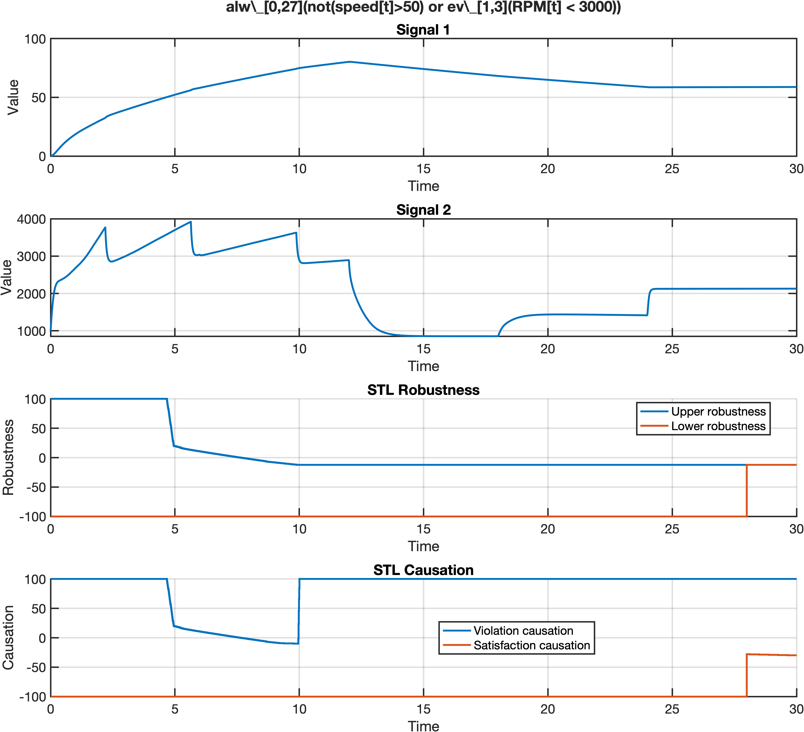

# CauMon: A Tool for Online Monitoring against Signal Temporal Logic

## Run in your local machine

### System requirement

- Operating system: Linux or MacOS;

- MATLAB (Simulink/Stateflow) version: >= 2020a. (MATLAB license needed)

### Installation of our tool:

- Clone the repository.
  1. `git clone https://github.com/choshina/CauMon.git`
  2. `git submodule init`
  3. `git submodule update`

- Run `make`
  
- Start MATLAB GUI, run `configure.m`

### Usage

- Users are required to prepare a script to start the monitor. One example is given in `experiment/test.m`
  

    > Specify the names of the signals. They must be in the same order with their occurrences in traces.
    ```matlab:Code
    signal_str = 'speed,RPM';
    ```
    > Specify an STL formula, following the syntax specified in Breach.
    ```matlab:Code
    phi_str = 'alw_[0,27](not(speed[t]>50) or ev_[1,3](RPM[t] < 3000))';
    ```
    > Specify the moment at which the monitor targets  
    ```matlab:Code
    tau = 0;
    ```
    > Specify the name of the file to load traces.
    > If needed, trace loading can be periodic; then a termination condition can be added.
    ```matlab:Code
    trace_file = 'data/AT_phi3_trace9.mat';
    load(trace_file, 'trace');
    ```
    > Start the robust monitor.
    ```matlab:Code
    [up_robM, low_robM] = stl_eval_mex_pw(signal_str, phi_str, trace, tau);
    ```
    > Start the causation monitor.
    ```matlab:Code
    [up_optCau, low_optCau] = stl_causation_opt(signal_str, phi_str, trace, tau);
    ```
    > Visualize the monitoring results.
    ```matlab:Code
    visualize(...
        trace, ...          % time and signals
        phi_str, ...        % formula string for title
        up_robM, low_robM, ... % robustness metrics
        up_optCau, low_optCau, ... % causation metrics
        'result.png' ... % output file
    );
    ```
- Run the script. A figure will be displayed and stored.
  
  

